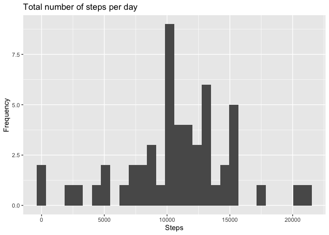
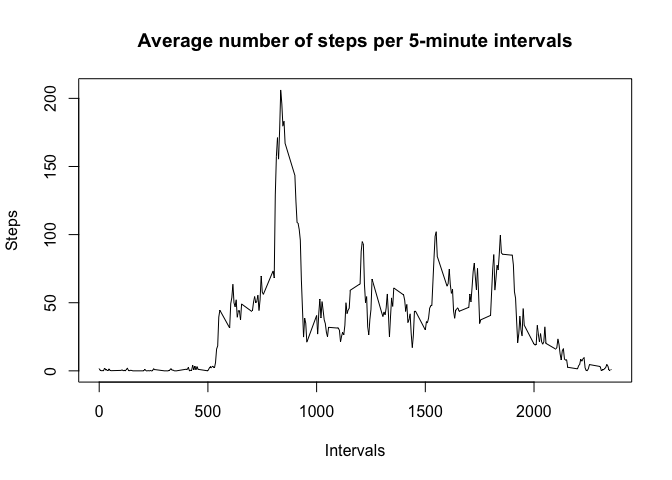
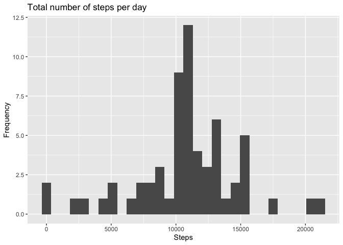
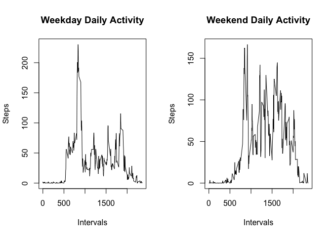

## Loading and preprocessing the data

This data tracks the daily steps taken by an annonymous individual from October through Nomvember of 2012. Steps were counted in 5-minute intervals each day. 


```r
activity<-read.csv("activity.csv")
```


## What is mean total number of steps taken per day?

The following code chunk summarizes the total number of steps taken per day, as well as calculates the mean and median of the data. The total number of steps taken per day is graphically depicted in the histogram below. 

```r
      steps<-aggregate(steps~date, activity, FUN=sum)
      mean(steps$steps)
```

```
## [1] 10766.19
```

```r
      median(steps$steps)
```

```
## [1] 10765
```


```r
      library(ggplot2)
      with(steps,qplot(steps,main= "Total number of steps per day", xlab="Steps", ylab="Frequency"))
```

```
## `stat_bin()` using `bins = 30`. Pick better value with `binwidth`.
```

<!-- -->
## What is the average daily activity pattern?

Daily activity was analyzed by averaging the number of steps taken across the day during the 5-minute intervals. The analysis is depicted in the time series plot built by the following code:


```r
      intervals<-aggregate(steps~interval, activity, FUN=mean)
      with(intervals, plot(interval, steps, type = "l", 
            main = "Average number of steps per 5-minute intervals", 
            xlab = "Intervals", ylab="Steps"))
```

<!-- -->
Based on the daily activity pattern, we find that the highest average number of steps across the two-month priod is 206.17 and that occurs at interval number 835.


```r
      which.max(intervals$steps)
```

```
## [1] 104
```

```r
      intervals[104,]
```

```
##     interval    steps
## 104      835 206.1698
```
## Imputing missing values

The presence of missing values can introduce bias into some types of calculations. Therefore we should identify these values and remove them.

In this particular data set there is a total of 2304 NA rows:


```r
      sum(is.na(activity))
```

```
## [1] 2304
```
To fill in these missing values, I used the average number of steps for each 5-min interval. I rearranged the data frame using the dplyr package to be in the same format as the original data used. 


```r
names(intervals)[2]<-"avg.steps"
      activitycomplete<-merge(activity,intervals)
      activitycomplete$steps[is.na(activitycomplete$steps)]<-activitycomplete$avg.steps[is.na(activitycomplete$steps)]
      library(dplyr)
```

```
## 
## Attaching package: 'dplyr'
```

```
## The following objects are masked from 'package:stats':
## 
##     filter, lag
```

```
## The following objects are masked from 'package:base':
## 
##     intersect, setdiff, setequal, union
```

```r
      tbl_df(activitycomplete)
```

```
## # A tibble: 17,568 x 4
##    interval steps date       avg.steps
##       <int> <dbl> <chr>          <dbl>
##  1        0  1.72 2012-10-01      1.72
##  2        0  0    2012-11-23      1.72
##  3        0  0    2012-10-28      1.72
##  4        0  0    2012-11-06      1.72
##  5        0  0    2012-11-24      1.72
##  6        0  0    2012-11-15      1.72
##  7        0  0    2012-10-20      1.72
##  8        0  0    2012-11-16      1.72
##  9        0  0    2012-11-07      1.72
## 10        0  0    2012-11-25      1.72
## # … with 17,558 more rows
```

```r
      activitycomplete<-select(activitycomplete, -avg.steps)
      activitycomplete<-arrange(activitycomplete, date)
      activitycomplete<-select(activitycomplete,steps,date,interval)
      head(activitycomplete)
```

```
##       steps       date interval
## 1 1.7169811 2012-10-01        0
## 2 0.3396226 2012-10-01        5
## 3 0.1320755 2012-10-01       10
## 4 0.1509434 2012-10-01       15
## 5 0.0754717 2012-10-01       20
## 6 2.0943396 2012-10-01       25
```
We repeat the summary analysis for the data set with the filled in NA values. The total number of steps taken per day is graphically depicted in the histogram below and the mean and median are also calculated. 


```r
      complete<-aggregate(steps~date, activitycomplete, FUN=sum)
      with(complete,qplot(steps,main= "Total number of steps per day", xlab="Steps", ylab="Frequency"))
```

```
## `stat_bin()` using `bins = 30`. Pick better value with `binwidth`.
```

<!-- -->

```r
      mean(complete$steps)
```

```
## [1] 10766.19
```

```r
      median(complete$steps)
```

```
## [1] 10766.19
```

When the missing values were added to the data set, based on the average number of steps per interval, the overall range of the data increased. The mean seems to be unaffected and the median increased slightly (by 1.19)

## Are there differences in activity patterns between weekdays and weekends?

For this part of the analysis, we are comparing daily activity on weekdays vs weekends. First, we figure out what days of the week each date in the data set corresponds to: 


```r
      activitycomplete$days<-weekdays(as.Date(activitycomplete$date))
      activitycomplete$class<-as.factor(activitycomplete$days=="Saturday"|activitycomplete$days=="Sunday")
      levels(activitycomplete$class)<-c("weekday", "weekend")
      head(activitycomplete)
```

```
##       steps       date interval   days   class
## 1 1.7169811 2012-10-01        0 Monday weekday
## 2 0.3396226 2012-10-01        5 Monday weekday
## 3 0.1320755 2012-10-01       10 Monday weekday
## 4 0.1509434 2012-10-01       15 Monday weekday
## 5 0.0754717 2012-10-01       20 Monday weekday
## 6 2.0943396 2012-10-01       25 Monday weekday
```
Then, I subsetted the data into weekdays and weekends to calculate the average steps taken per interval. 


```r
      weekdays<-subset(activitycomplete, class=="weekday")
      weekends<-subset(activitycomplete, class=="weekend")
      weekdaysmean<-aggregate(steps~interval, weekdays, FUN=mean)
      weekendsmean<-aggregate(steps~interval, weekends, FUN=mean)
```

Subsequently, graphs were formulated depicting the differences in daily activity for weekdays vs weekends. 


```r
      par(mfrow=c(1,2))
      
      with(weekdaysmean, plot(interval, steps, type="l", main="Weekday Daily Activity", xlab="Intervals", ylab="Steps"))
      
      with(weekendsmean, plot(interval, steps, type="l", main="Weekend Daily Activity", xlab="Intervals", ylab="Steps"))
```

<!-- -->
